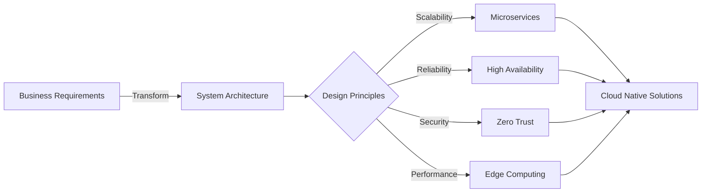

#  Lokesh Kumar | System Architect

<div align="center">

[](https://git.io/typing-svg)


</div>

---

<div align="center">
  
  
</div>

##  Tech Stack & Architecture Expertise

<table align="center">
<tr>
<td width="50%" valign="top">

### Cloud Platforms & Virtual Infrastructure


### Container & Orchestration


### CI/CD & GitOps


### Observability & Monitoring


</td>
<td width="50%" valign="top">

### Data & Messaging Platforms


### Programming & Frameworks


### Infrastructure as Code & Config Management


### API Gateways & Service Mesh


</td>
</tr>
</table>

##  Featured Project: MCP Servers Collection

<div align="center">

### Enterprise-Ready Model Context Protocol (MCP) Servers

<a href="https://github.com/asklokesh/mcp-servers">
  
</a>

</div>

<table>
<tr>
<td width="33%" align="center">

###  Salesforce MCP
[](https://github.com/asklokesh/salesforce-mcp-server)
[](https://github.com/asklokesh/salesforce-mcp-server)

Enterprise CRM integration with full API coverage

</td>
<td width="33%" align="center">

###  AWS MCP
[](https://github.com/asklokesh/aws-mcp-server)
[](https://github.com/asklokesh/aws-mcp-server)

Comprehensive AWS services integration

</td>
<td width="33%" align="center">

###  GCP MCP
[](https://github.com/asklokesh/gcp-mcp-server)
[](https://github.com/asklokesh/gcp-mcp-server)

Google Cloud Platform complete integration

</td>
</tr>
<tr>
<td width="33%" align="center">

###  Jenkins MCP
[](https://github.com/asklokesh/jenkins-mcp-server)
[](https://github.com/asklokesh/jenkins-mcp-server)

CI/CD automation server integration

</td>
<td width="33%" align="center">

###  ArgoCD MCP
[](https://github.com/asklokesh/argocd-mcp-server)
[](https://github.com/asklokesh/argocd-mcp-server)

GitOps continuous delivery for Kubernetes

</td>
<td width="33%" align="center">

###  25+ More
[](https://github.com/asklokesh)
[](https://github.com/asklokesh)

Enterprise integrations in development

</td>
</tr>
</table>

##  Architecture Philosophy

<div align="center">



</div>

### Core Principles

<table>
<tr>
<td width="25%" align="center">


**Auto-scaling architectures** that grow with business needs
</td>
<td width="25%" align="center">


**Defense in depth** with multiple security layers
</td>
<td width="25%" align="center">


**Fault-tolerant systems** with automatic failover
</td>
<td width="25%" align="center">


**Optimized architectures** for minimal latency
</td>
</tr>
</table>

##  Professional Experience

<div align="center">

| Role | Focus Area | Key Achievements |
|------|------------|------------------|
| **System Architect** | Enterprise Architecture | Designed multi-cloud solutions serving 10M+ users |
| **Cloud Engineer** | Infrastructure Design | Reduced infrastructure costs by 40% through optimization |
| **API Specialist** | Integration Architecture | Built 30+ enterprise API integrations |
| **DevOps Lead** | CI/CD & Automation | Achieved 99.9% deployment success rate |

</div>

##  Current Focus

<div align="center">

```
┌─────────────────────────────────────────────────────────────────┐
│                                                                 │
│   🔴 Building Enterprise MCP Servers for GenAI Integration     │
│                                                                 │
│   ⚫ Architecting Cloud-Native Solutions at Scale              │
│                                                                 │
│   🔴 Developing Infrastructure Automation Frameworks            │
│                                                                 │
│   ⚫ Creating Open-Source Tools for the Community              │
│                                                                 │
└─────────────────────────────────────────────────────────────────┘
```

</div>

##  Connect & Collaborate

<div align="center">

[](https://linkedin.com/in/asklokesh)
[](https://github.com/asklokesh)
[](mailto:asklokesh@github.com)


</div>

---

<div align="center">
  
</div>